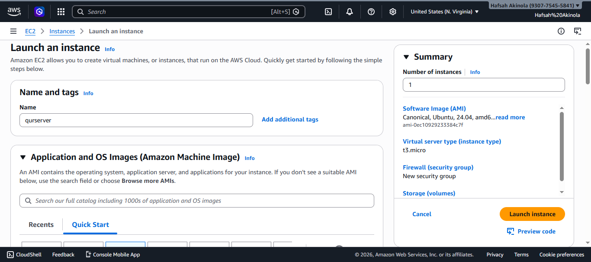
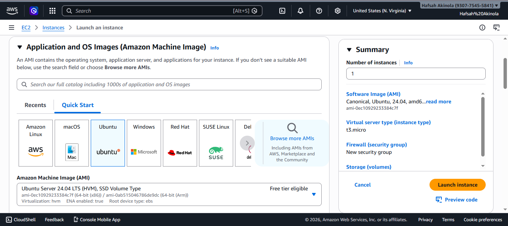
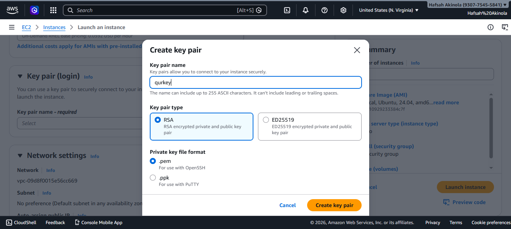

## Setup Web Server Using Apache and AWS EC2 Instance

This project is to create a secure and scalable web server on AWS EC2 configuring Apache2 as the web server software and hosting a simple, professional static landing page for the company.

**Steps**

1. Go to EC2 on AWS Console, create and launch an instance. Set name, create new key pair or use an exising one and choose Ubuntu as AMI.

